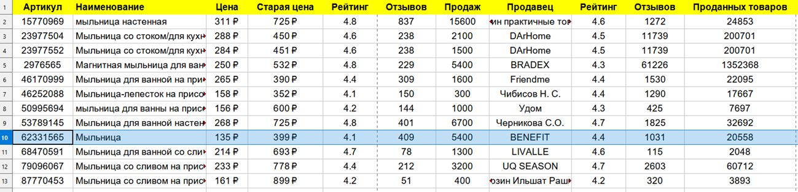

# Набор скриптов для парсинга сайтов

Разные скрипты для **Puppeteer** и Node.js для парсинга сайтов с использованием JavaScript.

## Wildberries

Скрипт **wb.js** считывает список ссылок из файла **wb-urls.txt**, собирает данные о товаре, цене, отзывах, продавце. Сохраняет все в формате CSV (на диске T:) для дальнейшего удобного сравнения и анализа в редакторе таблиц.

## Кинопоиск

Скрипт **kinopoisk.js** считывает название фильмов из файла **kino.txt** и открывает их в новых вкладках браузера на сайте Кинопоиска. Со страницы собираются рейтинги фильма и добавляются к названию в одном месте, теперь не надо скролить страницу вниз, чтобы узнать рейтинг IMDB. Новое название ярко подсвечивается для быстрого привлечения внимания. Так же рейтинги прибавляются к названию страницы.

## Сохранить HTML в PDF

Простой скрипт **html to PDF.js** сохраняет страницу локального сервера <http://127.0.0.1:5500/index.html> в файл **PDF** на диске Т. Название нового файла формируется из названия страницы, запрещенные символы заменяются на "-". Возможно добавить в будущем считывание ссылок из буфера, из файла.
